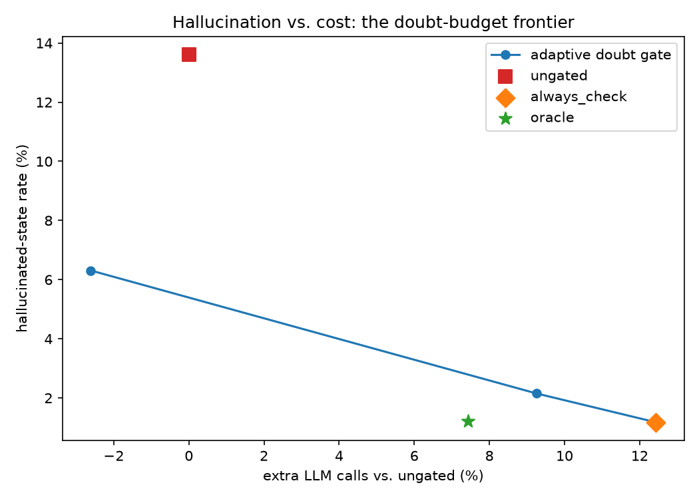

# Lucid

A "lie detector" for AI agents: a tiny trained world model watches an LLM plan
and flags the moment the agent's beliefs diverge from reality.

W1: deterministic warehouse environment, rollout generator, and a factored MLP
ensemble world model with calibrated uncertainty. W2: an LLM planner tracking
its own beliefs open-loop, the hallucinated-state metric, and the
draft→check→revise loop that lets the world model catch the lies. W3: an
adaptive doubt gate that spends revision calls only where they pay off, traced
as a cost-accuracy frontier.

## Run

    uv sync
    uv run lucid-gen-rollouts
    uv run lucid-train-wm
    uv run lucid-run-agent     # needs ANTHROPIC_API_KEY on first run; cached afterwards
    uv run lucid-frontier      # renders the W3 frontier chart from summary.json
    uv run pytest

Design docs: `docs/superpowers/specs/`.

## W3 results — the adaptive doubt-budget frontier

A world-model check is a free CPU forward pass; the cost is what you *do* about
a disagreement. The `DoubtGate` scores each disagreement from the WM's
self-confidence, its validity signal, and whether the disputed variables touch
the goal, then chooses: **revise** (pay an LLM call), **adopt** the WM's belief
silently (free correction), or **ignore** when the WM itself is uncertain.
Sweeping the threshold θ traces a frontier that a single fixed policy cannot.

100 episodes per arm (`configs/w3.toml`, seed 11):

| arm | θ | hallucinated-state | calls/episode | extra vs. ungated |
|---|---|---|---|---|
| ungated | — | 13.6% | 17.62 | — |
| **adaptive (hi)** | 0.7 | **6.3%** | 17.16 | **−2.6%** |
| **adaptive (mid)** | 0.45 | **2.15%** | 19.25 | +9.3% |
| adaptive (lo) | 0.2 | 1.18% | 19.81 | +12.4% |
| always_check | — | 1.18% | 19.81 | +12.4% |
| oracle | — | 1.22% | 18.93 | +7.4% |

Two operating points fixed gating can't offer:

- **adaptive (hi) is a free lunch** — it cuts hallucination by 54% (13.6% → 6.3%)
  while making *fewer* calls than the ungated baseline, because corrected beliefs
  let episodes finish in fewer steps. Strictly better than ungated on both axes.
- **adaptive (mid) reaches 2.15%** — within ~1 point of always_check's floor —
  for 74% of always_check's revision overhead.

At the low-θ end the gate converges to always_check exactly (it revises on
every disagreement), so the curve interpolates the whole span from ungated to
fully-checked with one knob.

**Honest notes.** The pre-registered target — one adaptive point with ≤ 2.5%
hallucination at ≤ 70% of always_check's extra calls — is *narrowly missed*:
adaptive (mid) hits 2.15% but at 74% of the overhead (a 26% saving, short of the
30% goal). Reported as measured; θ was not re-tuned post-hoc. The **oracle**
(perfect detection + full correction, ground-truth-peeking) lands at 1.22% —
essentially the achievable floor for this revision mechanism, and slightly
*cheaper* than always_check since it revises only on true divergences. That
always_check matches it confirms the near-perfect W1 world model is an excellent
stand-in for ground truth.

New API spend for W3: ~$5.70 total actual — ~$3.40 for the final six-arm set
(reconstructible from `summary.json`) plus ~$2.30 for a first oracle design that
withheld true values and was discarded (see the honest note above). The two W2
arms replay from cache for free; a warm rerun of every arm makes zero network
calls.

## W2 results — hallucination and the check→revise loop

Claude Haiku 4.5 plans in an 8-box warehouse, seeing only its goals, the
initial state, and per-action valid flags — never the true state. Each step it
asserts a believed next state; **hallucinated-state rate** = fraction of steps
where that belief is wrong. The `always_check` arm diffs every belief against
the W1 world model (which never sees the true state either) and asks the
planner to revise on disagreement, at most twice per step.

100 episodes per arm (`configs/w2.toml`, seed 11):

| metric | ungated | always_check |
|---|---|---|
| hallucinated-state rate | **13.6%** | **1.2%** (−91% relative) |
| task success | 99% | 100% |
| mean first divergence | step 7.1 | step 11.3 |
| LLM calls / episode | 17.62 | 19.81 (+12.4%) |
| invalid-action rate | 1.8% | 0.6% |
| parse failures | 0 / 1762 calls | 0 / 1981 calls |

Reference points from the GILP paper (arXiv:2606.27806): 17.6% → 3.5% for
~22% extra calls. Lucid's checker cuts deeper (−91% vs. −80%) for roughly half
the call overhead, because revisions only fire on the ~14% of steps where the
world model actually disagrees — the observation the W3 adaptive doubt-budget
gate is built on.

Every LLM call is content-hash-cached to `data/llm_cache/`; a warm rerun of
the full eval makes zero network calls and reproduces these numbers
byte-for-byte.

## W1 results — the world model

5-member factored MLP ensemble trained on 156k transitions from the
deterministic warehouse env (config: `configs/w1.toml`, 8 boxes / 5 shelves;
held-out test 18.9k transitions, novel-config probe 16.5k). The env was bumped
from 4 to 8 boxes per the W2 spec's contingency — Haiku barely hallucinated on
4-box tasks.

| metric | value |
|---|---|
| validity AUROC (test) | 0.996 |
| next-state exact match (test) | 0.9998 |
| ECE (per-variable confidence) | 9.7e-04 |
| novelty AUROC — disagreement | 1.000 |
| novelty AUROC — entropy | 1.000 |

Ensemble disagreement and entropy separate never-seen configurations from
familiar ones essentially perfectly — the uncertainty signal the doubt-budget
gate spends in W3. Plots: `data/wm/reliability.png`, `data/wm/separation.png`
(regenerate with the CLI commands above).

## Roadmap

- **W4** — live grounding monitor (belief vs. reality streaming over
  websockets) and the `@grounded` wrapper for arbitrary tool-using agents.
